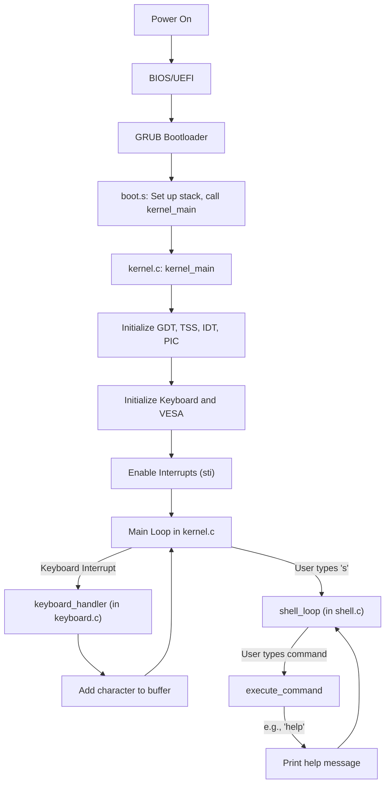

An operating system is a complex piece of software, and the one you've provided is a great example of a simple but functional kernel. Here's a detailed breakdown of each file, the OS concepts at play, and a flowchart to visualize the workflow.

### File-by-File Analysis

-----

#### **`boot.s`**

  * **Purpose:** This is the very first piece of code that runs. It's the bridge between the bootloader (GRUB) and your C kernel.
  * **`multiboot_header_start`:** This section is a special header that GRUB understands.
      * `0x1BADB002`: The "magic number" that identifies this as a Multiboot-compliant kernel.
      * `0x00000006`: Flags that tell GRUB you want a framebuffer (for graphics) and other info.
      * The following lines specify the desired graphics mode (1024x768x32).
  * **`start`:** The entry point of your OS.
      * `cli`: Disables interrupts immediately. This is crucial because the interrupt handling system isn't set up yet.
      * `mov esp, stack_top`: Sets up the stack pointer. The stack is a region of memory used for function calls and local variables.
      * `push ebx`, `push eax`: Pushes the Multiboot information pointer and the magic number onto the stack. These are arguments for `kernel_main`.
      * `call kernel_main`: Jumps to the `kernel_main` function in `kernel.c`.
  * **`.hang`:** An infinite loop that the OS will enter if `kernel_main` ever returns.

-----

#### **`gdt.c`, `gdt.h`, `gdt_asm.s`**

  * **Purpose:** These files manage the **Global Descriptor Table (GDT)**. In protected mode, you can't just access memory directly. The GDT defines segments of memory and their access rights (e.g., kernel code, user data).
  * **`gdt.h`:**
      * `struct gdt_entry`: Defines the structure of a single entry in the GDT.
      * `struct gdt_ptr`: Defines the structure of the GDT pointer, which is loaded into a special CPU register.
  * **`gdt.c`:**
      * `gdt_set_gate`: A helper function to create a GDT entry.
      * `init_gdt`:
          * Sets up the GDT pointer.
          * Creates GDT entries for:
              * A null segment (required).
              * Kernel Code Segment (CS).
              * Kernel Data Segment (DS).
              * User Code Segment.
              * User Data Segment.
          * `gdt_flush`: A call to an assembly function.
  * **`gdt_asm.s`:**
      * `gdt_flush`:
          * `lgdt`: Loads the GDT pointer into the CPU's GDTR register.
          * Reloads the segment registers (`ds`, `es`, `fs`, `gs`, `ss`) with the new kernel data segment selector.
          * `jmp 0x08:.flush`: A "far jump" that reloads the code segment register (`cs`) with the new kernel code segment selector.

-----

#### **`grub.cfg`**

  * **Purpose:** This is a configuration file for the GRUB bootloader.
  * **`menuentry "VORTEXOS"`:** Creates a menu option in GRUB.
  * **`set gfxmode=1024x768x32`:** Sets the desired graphics mode.
  * **`multiboot /boot/kernel.bin`:** Tells GRUB to load your kernel file.
  * **`boot`:** Boots the loaded kernel.

-----

#### **`interrupts.c`, `interrupts.h`, `interrupts_asm.s`**

  * **Purpose:** These files set up the **Interrupt Descriptor Table (IDT)** and handle interrupts. Interrupts are signals to the CPU that an event has occurred (e.g., a key press, a system timer tick, or a software error).
  * **`interrupts.h`:**
      * `struct idt_gate`: Defines the structure of an entry in the IDT. Each entry points to an interrupt handler.
      * `struct idt_ptr`: Defines the structure of the IDT pointer.
      * `struct interrupt_frame`: Defines the structure of the data that's pushed onto the stack when an interrupt occurs. This allows the C code to access the CPU's registers.
  * **`interrupts_asm.s`:**
      * `ISR_NOERRCODE`, `ISR_ERRCODE`, `IRQ`: Macros that generate the assembly code for the low-level interrupt handlers. These handlers:
          * `cli`: Disable other interrupts.
          * Push a dummy error code (if needed) and the interrupt number.
          * `jmp isr_common_stub` or `irq_common_stub`: Jump to a common handler.
      * `isr_common_stub`, `irq_common_stub`:
          * `pusha`: Pushes all general-purpose registers onto the stack.
          * Load the kernel data segment into the data segment registers.
          * `call isr_handler` or `call irq_handler`: Call the C-level interrupt handler.
          * `popa`, `iret`: Pop the registers and return from the interrupt.
  * **`interrupts.c`:**
      * `set_idt_gate`: A helper function to create an IDT entry.
      * `init_idt`:
          * Sets up the IDT pointer.
          * Creates IDT entries for all 256 possible interrupts, pointing them to the assembly handlers.
          * `pic_remap`: Remaps the Programmable Interrupt Controller (PIC).
          * `load_idt`: Calls an assembly function to load the IDT pointer into the CPU's IDTR register.
      * `isr_handler`: A generic handler for CPU exceptions.
      * `irq_handler`: A generic handler for hardware interrupts. It sends an End-of-Interrupt (EOI) signal to the PIC and calls the appropriate device driver's handler.

-----

#### **`kernel.c`**

  * **Purpose:** This is the heart of your operating system.
  * **`kernel_main`:**
      * `init_gdt`, `init_tss`, `init_idt`, `pic_remap`, `init_keyboard`: Initializes all the core components of the OS.
      * `asm volatile("sti")`: Enables interrupts. Now the OS can respond to keyboard presses and other events.
      * `init_vesa`: Initializes the graphics mode.
      * **Main Loop:** An infinite loop that:
          * Checks for keyboard input using `keyboard_has_input`.
          * If there's input, it gets the character with `keyboard_getchar`.
          * If the character is 's', it launches the `shell_loop`.

-----

#### **`keyboard.c`, `keyboard.h`**

  * **Purpose:** A device driver for the keyboard.
  * **`keyboard.h`:** Declares the functions that other parts of the OS can use to interact with the keyboard.
  * **`keyboard.c`:**
      * `scancodes`, `scancodes_shift`: Arrays that map keyboard scancodes to ASCII characters.
      * `keyboard_handler`: The interrupt handler for the keyboard. It's called every time a key is pressed or released.
          * Reads the scancode from the keyboard's data port.
          * Handles shift, caps lock, etc.
          * Converts the scancode to an ASCII character and adds it to a buffer.
      * `init_keyboard`: Installs the keyboard interrupt handler and enables the keyboard's IRQ.
      * `keyboard_getchar`: Gets a character from the keyboard buffer.
      * `keyboard_has_input`: Checks if there's a character in the buffer.

-----

#### **`linker.ld`**

  * **Purpose:** A script that tells the linker how to organize your compiled code and data into the final `kernel.bin` file.
  * **`ENTRY(start)`:** Sets the entry point of the kernel to the `start` label in `boot.s`.
  * **`SECTIONS`:** Defines the memory layout of the kernel.
      * `. = 2M;`: Sets the starting address of the kernel to 2MB. This is a common choice to avoid conflicts with low memory areas used by the BIOS.
      * `.text`, `.data`, `.rodata`, `.bss`: These sections place the code, initialized data, read-only data, and uninitialized data at specific locations in memory, aligned to 4KB boundaries (the size of a page).
      * `stack_bottom`, `stack_top`: Defines the start and end of the kernel's stack.

-----

#### **`makefile`**

  * **Purpose:** A build script that automates the process of compiling and linking your OS.
  * **`CC`, `CFLAGS`, `AS`, `ASFLAGS`, `LD`, `LDFLAGS`:** Variables that define the compiler, assembler, linker, and their flags.
  * **`all: $(ISO)`:** The default target, which builds the entire OS and creates a bootable ISO image.
  * **Rules:** The rest of the file defines rules for compiling each source file and linking them together.

-----

#### **`pic.c`, `pic.h`**

  * **Purpose:** A driver for the Programmable Interrupt Controller (PIC). The PIC is a chip that manages hardware interrupts from devices like the keyboard and timer.
  * **`pic.h`:** Declares the functions for interacting with the PIC.
  * **`pic.c`:**
      * `pic_remap`: Remaps the PIC's interrupt vectors. By default, they conflict with CPU exceptions, so they need to be moved to a different range.
      * `pic_send_eoi`: Sends an End-of-Interrupt signal to the PIC after an interrupt has been handled.
      * `pic_set_mask`, `pic_clear_mask`: Functions to enable or disable specific IRQs.

-----

#### **`port.h`**

  * **Purpose:** Provides a convenient way to read from and write to I/O ports. This is how the CPU communicates with hardware devices.
  * **`outb`, `inb`:** Inline assembly functions for outputting a byte to a port and inputting a byte from a port.

-----

#### **`shell.c`, `shell.h`**

  * **Purpose:** A simple command-line shell.
  * **`shell.h`:** Defines constants and function prototypes for the shell.
  * **`shell.c`:**
      * `init_shell`: Initializes the shell's state.
      * `print_prompt`: Prints the shell prompt.
      * `execute_command`: Parses a command string and executes the corresponding action (e.g., `help`, `clear`, `echo`).
      * `shell_loop`: The main loop of the shell, which reads user input and calls `execute_command`.

-----

#### **`string.c`, `string.h`**

  * **Purpose:** A minimal C standard library with some basic string manipulation functions.
  * **`mystrlen`, `mystrcmp`, `mystrcpy`, `mystrcat`, `mymemset`, `mymemcpy`:** Custom implementations of common string and memory functions. You can't use the standard C library in a freestanding environment (like an OS kernel), so you have to write your own.

-----

#### **`tss.c`, `tss.h`**

  * **Purpose:** Manages the **Task State Segment (TSS)**. The TSS is a structure that holds information about a task. In this OS, its primary purpose is to tell the CPU where the kernel's stack is. When an interrupt occurs while the CPU is in user mode, it will automatically switch to the kernel stack defined in the TSS.
  * **`tss.h`:** Defines the `tss_entry` structure.
  * **`tss.c`:**
      * `init_tss`:
          * Sets up a GDT entry for the TSS.
          * Initializes the TSS structure, setting the kernel stack segment (`ss0`) and stack pointer (`esp0`).
          * `asm volatile("ltr %%ax" : : "a"(0x28))`: Loads the TSS selector into the CPU's Task Register (TR).

-----

#### **`vesa.c`, `vesa.h`**

  * **Purpose:** A driver for video graphics, using the **VESA BIOS Extensions (VBE)**.
  * **`vesa.h`:**
      * Defines structures for VBE information blocks.
      * Declares functions for drawing on the screen.
  * **`vesa.c`:**
      * `init_vesa`: Gets the framebuffer address and other graphics information from the Multiboot structure.
      * `set_pixel`: Draws a single pixel on the screen.
      * `fill_screen`: Fills the entire screen with a color.
      * `draw_char_scaled`, `draw_string_scaled`: Draws characters and strings on the screen, using a built-in font.

-----

### OS Concepts Used

  * **Booting:** The process starts with the BIOS/UEFI, which loads the GRUB bootloader. GRUB then loads your kernel.
  * **Protected Mode:** A CPU mode that allows for memory protection and virtual memory. Your OS runs in 32-bit protected mode.
  * **Memory Management:**
      * **Segmentation:** The GDT is used to define memory segments.
      * **Paging:** Not implemented in this OS, but it's the next step in memory management.
  * **Interrupts and Exception Handling:** The IDT is used to handle both hardware interrupts (from devices) and software exceptions (like a division by zero).
  * **Device Drivers:** The OS includes drivers for the keyboard and display (VESA).
  * **Concurrency:** This OS is single-tasking, but the interrupt handling provides a basic form of concurrency (the CPU can be interrupted from its main task to handle an event).
  * **User Interface:** A simple command-line shell provides a basic user interface.

### C Datatypes and Prebuilt Functions

  * **`stdint.h`:** Provides fixed-width integer types like `uint32_t`. This is crucial for OS development, where you need to be very precise about the size of your data structures.
  * **`stddef.h`:** Provides types like `size_t`.
  * **`__attribute__((packed))`:** A GCC attribute that tells the compiler not to add padding to a structure. This is essential for structures that are shared with hardware or assembly code, as they must have a specific layout in memory.
  * **Inline Assembly (`asm volatile`)**: Allows you to embed assembly code directly into your C code. This is necessary for privileged instructions that C doesn't have direct access to, like `lgdt`, `lidt`, `ltr`, `in`, and `out`.

-----

### Flowchart

Here's a flowchart that illustrates the overall workflow of your operating system:

